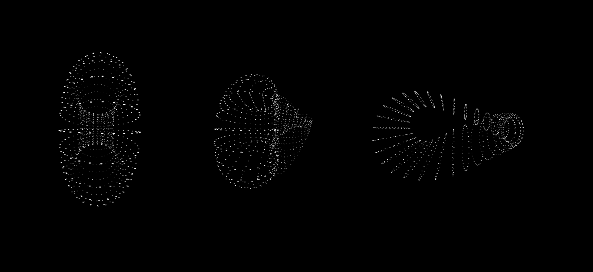

# Parametric Surfaces

[This can be seen and played with here](http://js-geom.now.sh).

This project was to help me learn more about parametric (or algebraic) surfaces. I ended up here after being shown the following algorithm for a sphere by Prof. Mick Grierson while studying on the Creative Computing Msc at the Creative Computing Institute (London) in 2019:

``` javascript
for (var i = 0; i < dim; i++) {                
  var z = size * Math.cos(spacing / 2 * i);
  var s = size * Math.sin(spacing / 2 * i);
      for (var j = 0; j < dim; j++ ) {
      var point = [
          cos(spacing * j) * s, 
          sin(spacing * j) * s, 
          z
      ];
      points.push(point);
  }
}
```

I played with this formula to generate other shapes such as a cube or a cylinder. I didn't know at the time but these are known as _parametric surfaces_ defined by _spherical coordinates_. The general conversion of _spherical to Cartesian_ coordinates is:

<a href="https://www.codecogs.com/eqnedit.php?latex=\begin{array}{l}x&space;=&space;\rho&space;sin&space;(\phi)&space;cos&space;(\theta)\\y&space;=&space;\rho&space;sin&space;(\phi)&space;sin&space;(\theta)\\z&space;=&space;\rho&space;cos&space;(\theta)\end{array}" target="_blank"></a>

The next thing to know is the &phi; and &theta; are _parameters_ which are angles defined in terms of &pi; and &rho; is a radius, as in polar coordinates. Re-writing the algorithm for a sphere above into a more general form, we get:


```javascript
makePoints(){
    let x, y, z;
    let s = this.scale;
    for(let i=0; i<this._slices+1; i++){
        let u = i * Math.PI / this._slices;
        for(let j=0; j<this._segments; j++){
            let v = j * 2 * Math.PI / this._slices;

            x = Math.sin(u) * Math.cos(v);
            y = Math.cos(u);
            z = -Math.sin(u) * Math.sin(v);

            let p = new Vec3d(x*s, y*s, z*s);
            this._points.push(p);
        }
    }
}
```

`u` and `v` in this case are the _parameters_ &theta; and &phi; respectively. `u` runs from 0 to &pi; and `v` from 0 to 2&pi;.

Much like the general equation for a circle (in terms of _polar_ coordinates) which can be manipulated and rearranged to form new shapes (the [Superformula](https://en.wikipedia.org/wiki/Superformula) being my favourite example of this), the spherical coordinates of a sphere can also be manipulated. This is a Torus:

<a href="https://www.codecogs.com/eqnedit.php?latex=\begin{array}{l}&space;x&space;=&space;(c&plus;a&space;cos(v))cos(u)\\&space;y&space;=&space;(c&plus;a&space;cos(v))sin(u)\\&space;z&space;=&space;a&space;sin(v)&space;\end{array}" target="_blank"></a>

```javascript
// TORUS

let x, y, z;
let s = this.scale * 0.2;

for (var i = 0; i < this._slices+1; i++) {
    let u = i * 2 * Math.PI / this._slices; // theta

    for (var j = 0; j < this._segments; j++) {
        let v = j * 2 * Math.PI / this._segments; // phi

        x = (this.c + this.a * Math.cos(v))*Math.cos(u);
        y = (this.c + this.a * Math.cos(v))*Math.sin(u);
        z = this.a * Math.sin(v);

        let p = new Vec3d(x * s, y * s, z * s);
        this._points.push(p);
    }
}
```

`a` here is the radius of the tube (how thick the torus is), and `c` is the diameter from the origin, to the centre of the tube. (You can see here my hacky scaling implementation, more on this later.)

Now that I can comfortably represent different surfaces by the same general formula, I could play with more complex forms like a Klein Bottle. Given that the general formula is the same, this meant that the data structures were identical (same number of vertices per slice, etc.), which meant the rendering was the same for each shape. So I could animate one into the other, by setting a new set of vertices as targets for the current vertices.



The rendering is a simple process of scaling a line drawn to the canvas, based on a predefined _Field of View_ (FOV) and the z-value of the the vertex, also shown to me by Mick Grierson.

I have taken this as far as I can with the rudimentary rendering process. It glitches out and behaves strangely when vertices move behind the non-existent camera (-FOV). It has the ability to render faces as rectangles (the code is in there), but I do not have an easy way to create a back-to-front ordering of the faces, or a painterly algorithm (things I do not know much about yet), without a defined world/view/model-space. So I think I'm going to continue this approach of implementing the bare minimum to acheive good results, but a bit more sophistocated with __matrices__ and __homogenous coordinates__ and this fun stuff.

# Resources

[Wolfram Closed Surfaces](https://mathworld.wolfram.com/topics/ClosedSurfaces.html)

[Wolfram Algebraic Surfaces](https://mathworld.wolfram.com/topics/AlgebraicSurfaces.html)

[Math Insight - Spherical Coordinates](https://mathinsight.org/spherical_coordinates)

[Khan Academy - Parametrizing a Surface](https://www.khanacademy.org/math/multivariable-calculus/integrating-multivariable-functions/surface-parametrization/v/introduction-to-parametrizing-a-surface-with-two-parameters)

[3D Wireframes in SVG](https://prideout.net/blog/svg_wireframes/) - Great to see simple implementations of all I've spoken about. I referenced this code a lot.

[CodeCogs - LaTeX Style Formulae](https://www.codecogs.com/latex/eqneditor.php)
